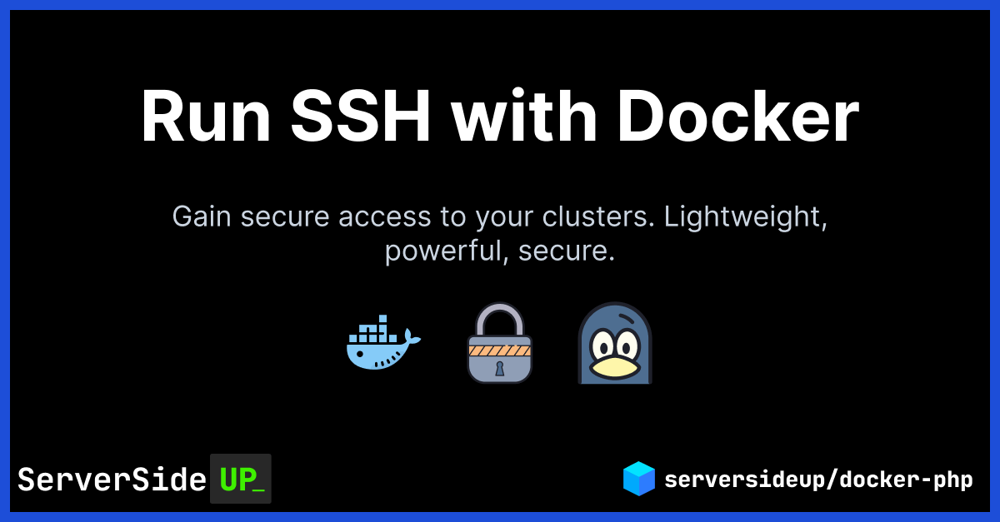

<p align="center">
		
</p>
<p align="center">
	<a href="https://actions-badge.atrox.dev/serversideup/docker-ssh/goto?ref=main"></a>
	<a href="https://github.com/serversideup/docker-ssh/blob/main/LICENSE" target="_blank"></a>
	<a href="https://github.com/sponsors/serversideup"></a>
</p>

Hi! We're [Dan](https://twitter.com/danpastori) and [Jay](https://twitter.com/jaydrogers). We're a two person team with a passion for open source products. We created [Server Side Up](https://serversideup.net) to help share what we learn.

### Find us at:

* 📖 [Blog](https://serversideup.net) - get the latest guides and free courses on all things web/mobile development.
* 🙋 [Community](https://community.serversideup.net) - get friendly help from our community members.
* 🤵‍♂️ [Get Professional Help](https://serversideup.net/get-help) - get guaranteed responses within next business day.
* 💻 [GitHub](https://github.com/serversideup) - check out our other open source projects
* 📫 [Newsletter](https://serversideup.net/subscribe) - skip the algorithms and get quality content right to your inbox
* 🐥 [Twitter](https://twitter.com/serversideup) - you can also follow [Dan](https://twitter.com/danpastori) and [Jay](https://twitter.com/jaydrogers)
* ❤️ [Sponsor Us](https://github.com/sponsors/serversideup) - please consider sponsoring us so we can create more helpful resources

# About this project
This is a super simple SSHD container based on Ubuntu 20.04. It works great if you need to create a secure tunnel into your cluster.

# What this image does
It does one thing very well:

* It's a hardened SSH server (perfect for encrypted tunnels into your cluster)
* Set authorized keys via the `AUTHORIZED_KEYS` environment variable
* Set authorized IP addresses via the `ALLOWED_IPS` environment variable
* It automatically generates the SSH host keys and will persist if you provide a volume
* It's based off of [S6 Overlay](https://github.com/just-containers/s6-overlay), giving you a ton of flexibility
* It also includes the `ping` tool for troubleshooting connections
* It's automatically updated via Github actions

# Usage instructions
All variables are documented here:

**🔀 Variable Name**|**📚 Description**|**#️⃣ Default Value**
:-----:|:-----:|:-----:
PUID|User ID the SSH user should run as.|9999
PGID|Group ID the SSH user should run as.|9999
SSH\_USER|Username for the SSH user that other users will connect into as.|tunnel
SSH\_GROUP|Group name used for our SSH user.|tunnelgroup
SSH\_USER\_HOME|Home location of the SSH user.|/home/tunnel
SSH\_PORT|Listening port for SSH server (on container only. You'll still need to publish this port).|2222
SSH\_HOST\_KEY\_DIR|Location of where the SSH host keys should be stored.|/etc/ssh/ssh\_host\_keys/
AUTHORIZED\_KEYS|🚨 <b>Required to be set by you.</b> Content of your authorized keys file (see below)| 
ALLOWED\_IPS|🚨 <b>Required to be set by you.</b> Content of allowed IP addresses (see below)| 


### 1. Set your `AUTHORIZED_KEYS` environment variable
You can provide multiple keys by loading the contents of a file into an environment variable.
```
AUTHORIZED_KEYS="$(cat .ssh/my_many_ssh_public_keys_in_one_file.txt)"
```
### 2. Set your `ALLOWED_IPS` environment variable
Set this in the same context of [AllowUsers](https://www.ssh.com/academy/ssh/sshd_config)This example shows a few scenarios you can do:
```
ALLOWED_IPS="AllowUsers *@192.168.1.0/24 *@172.16.0.1 *@10.0.*.1"
```

### 3. Forward your external port to `2222` on the container
You can see that I am forwarding `12345` to `2222`.
```
docker run --rm --name=ssh --network=web -p 12345:2222 localhost/ssh
```
This means I would connect with:
```
ssh -p 12345 tunnel@myserver.test
```

# Submitting issues and pull requests
Since there are a lot of dependencies on these images, please understand that it can make it complicated on merging your pull request.

We'd love to have your help, but it might be best to explain your intentions first before contributing.

### Like we said -- we're always learning
If you find a critical security flaw, please open an issue or learn more about [our responsible disclosure policy](https://www.notion.so/Responsible-Disclosure-Policy-421a6a3be1714d388ebbadba7eebbdc8).